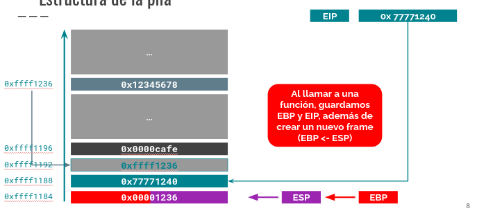

### Buffer Overflow

Los ataques de secuestro de control de flujo consisten en aprovechar la entrada de datos de un programa para modificar las instrucciones a ejecutar por este, a partir del aprovechamiento de características propias de la arquitectura del sistema. En este apunte nos enfocaremos en un problema de seguridad denominado __Buffer Overflow__, el cual sobreescribe parte de la sección de memoria encargada de definir a qué líneas de código ejecutar.

Partiremos este capítulo explicando cómo funciona el manejo de memoria en sistemas con arquitectura x86, para luego hablar del ataque en específico. Finalizaremos con un pequeño ejemplo en código de cómo ejecutar un Buffer Overflow en un programa sin mecanismos de defensa.

### Instrucciones y registros en ASM

Como ya se vio en el capítulo de Reversing, el código que escribimos al programar en un lenguaje compilado es transformado en un código equivalente en funcionalidad pero mucho más simple de interpretar, denominado _Assembler_ (ASM). Este código corre con varias restricciones que no aplican en lenguajes de programación de más alto nivel:

* Las variables utilizables de forma directa se llaman **registros** y son limitadas en número y capacidad. Dependiendo de la arquitectura y del tipo de procesador, un registro puede guardar entre 8 y 256 bits. Los registros más importantes para conocer son: 
  - `EAX`, `EBX`, `ECX`, `EDX`: Registros de 32 bits utilizados de forma general, por ejemplo, para almacenar argumentos de una función. Si se les quita la `E` que llevan de prefijo, representan registros de 16 bits, y si se les cambia la `E` por una `R`.
  - `EBP`, `ESP`, `EDI`, `ESI`, `EIP`: Punteros, es decir, apuntan direcciones de memoria RAM en las cuales se encuentran datos a utilizar. La utilidad específica de algunos de ellos se explicará más adelante.
  - Operaciones `add`, `sub`, `mul`, `div`, `and`, `xor`: Sirven para operar entre 2 registros o constantes. El valor se guarda en un tercer registro definido en la misma instrucción.
  - Operaciones de pila `push` y `pop`: permiten sacar y agregar datos de una **pila**, la cual se definirá en la siguiente sección
  - Operaciones de control de flujo `cmp`, `je`, `jne`, `jz`, `jg`, `jl`: Permiten condicionar la ejecución de código según un resultado de comparación previo (con `cmp`). También permiten implementar **loops**.

### Manejo de Memoria

La imagen superior muestra cómo se ordena la memoria en un sistema x86. La imagen muestra las direcciones de memoria partiendo abajo y creciendo hacia arriba. Estas tienen un tamaño de 32 bits (4 bytes) y se acceden de 4 en 4 bytes.

Existen 6 bloques importantes en la memoria completa:

 - **Stack (Pila)** Acá se almacenan las variables locales de los programas. Veremos más adelante que cada vez que se llama a una nueva función, se agrega un _frame_ al stack. Un _frame_ equivale al ambiente local inmediato de variables locales de una función. Como se ve en la imagen, **El Stack crece hacia abajo** (direcciones de memoria decrecientes).
 - **Espacio Libre**: Entre el _stack_ y el _heap_ hay memoria libre. El crecimiento de ambos disminuye la cantidad de memoria libre disponible.
 - **Heap**: Espacio que maneja la memoria dinámica, es decir, en el caso de C, las variables declaradas con `malloc`, además de algunas funciones.
 - **BSS**: Memoria variable reservada antes de ejecutar el _main_ de un programa en C.
 - **Data**: Constantes.
 - **Text**: Instrucciones en ASM a ejecutar.

### La Pila (_Stack_)

Como se mencionó anteriormente, la pila es el lugar en el que se guardan las variables locales de las funciones. Cada vez que entramos a una función, creamos un nuevo _frame_, el cual se inicializa como una pila vacía, en el cual colocamos las nuevas variables locales a crearse. Al momento de salir del frame, este se descarta, activándose nuevamente el frame inmediatamente anterior.

Al entrar a un nuevo frame, se guarda la dirección de memoria actual dentro de la función (`EIP`) en la misma pila, y luego este valor se llena con el de la función anidada. De esta forma, al salir de la función anidada, se sabrá como volver a la función anterior.

¿Cómo sabemos donde parte y donde termina la pila? Usamos los punteros `esp` y `ebp` para guardar estos datos. `ebp` registra la dirección de memoria en la cual parte el frame actual, mientras `esp` guarda la dirección de memoria siguiente a la última utilizada. Cuando se crea un frame nuevo, ambos valores se guardan en la pila y se setean al valor siguiente al último de la pila, emulando de este modo una pila vacía, ya que base y tope son la misma posición.

El siguiente conjunto de imágenes muestra cómo se opera en la pila y cómo se crean frames.

Para eliminar un frame, se siguen los pasos inversos de la segunda imagen, es decir, se cargan los valores de más arriba de la pila como `esp`, `ebp` y `eip`.

### Shellcode

¿Cómo se guarda el código que ejecutamos en `Data`? Al igual que cualquier dato del computador: con bits y bytes. Esto quiere decir que una variable con la forma y valor adecuado podría perfectamente ser interpretada como un programa, ya que el lenguaje de los datos y el lenguaje de las aplicaciones comparten el mismo alfabeto.

Acá entra en juego el concepto de shellcode. Un `shellcode` es un programa que permite elevar privón como valor interno de un programa compatible con la entrega de un `input` ejecutable.

### El Ataque

### Uso en CTFs